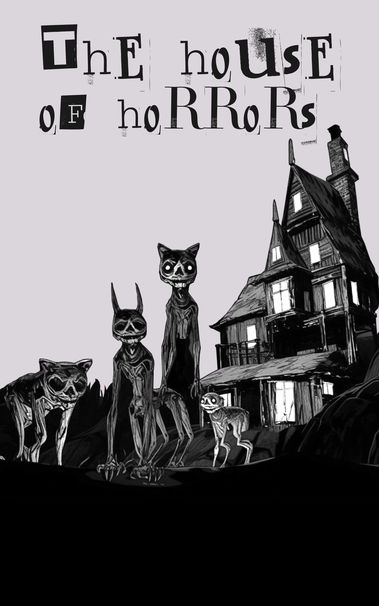
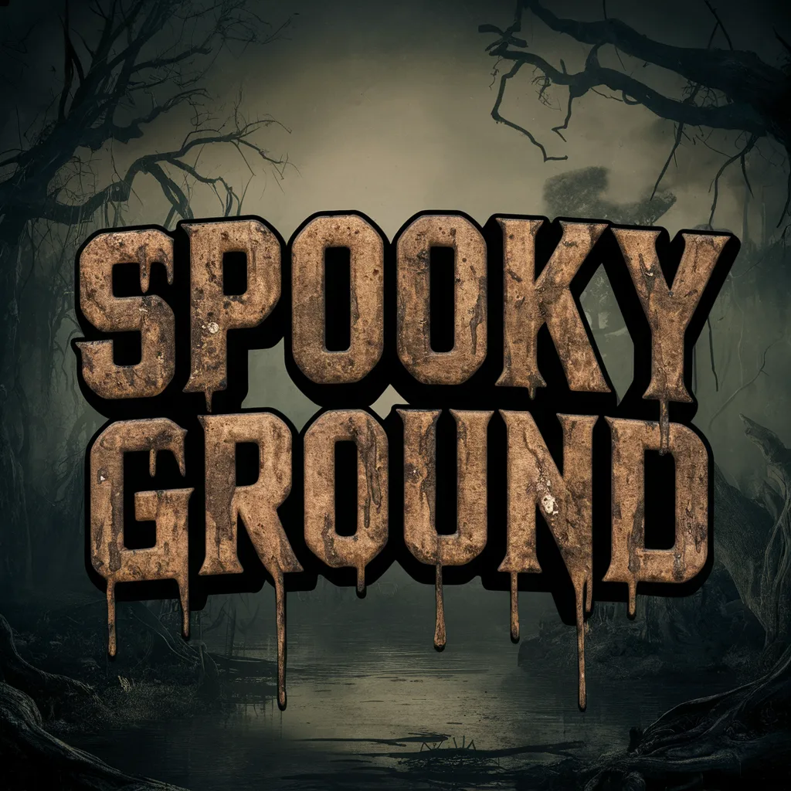
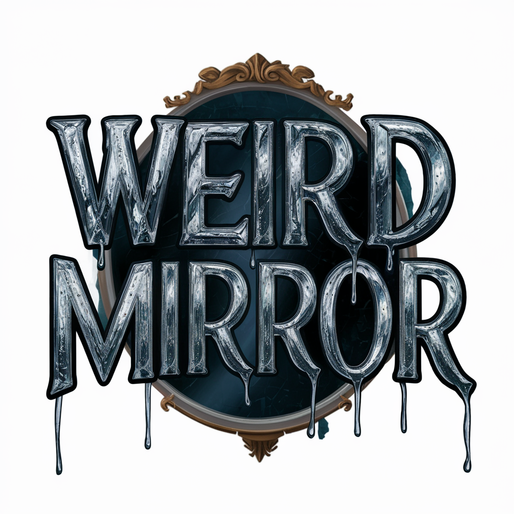
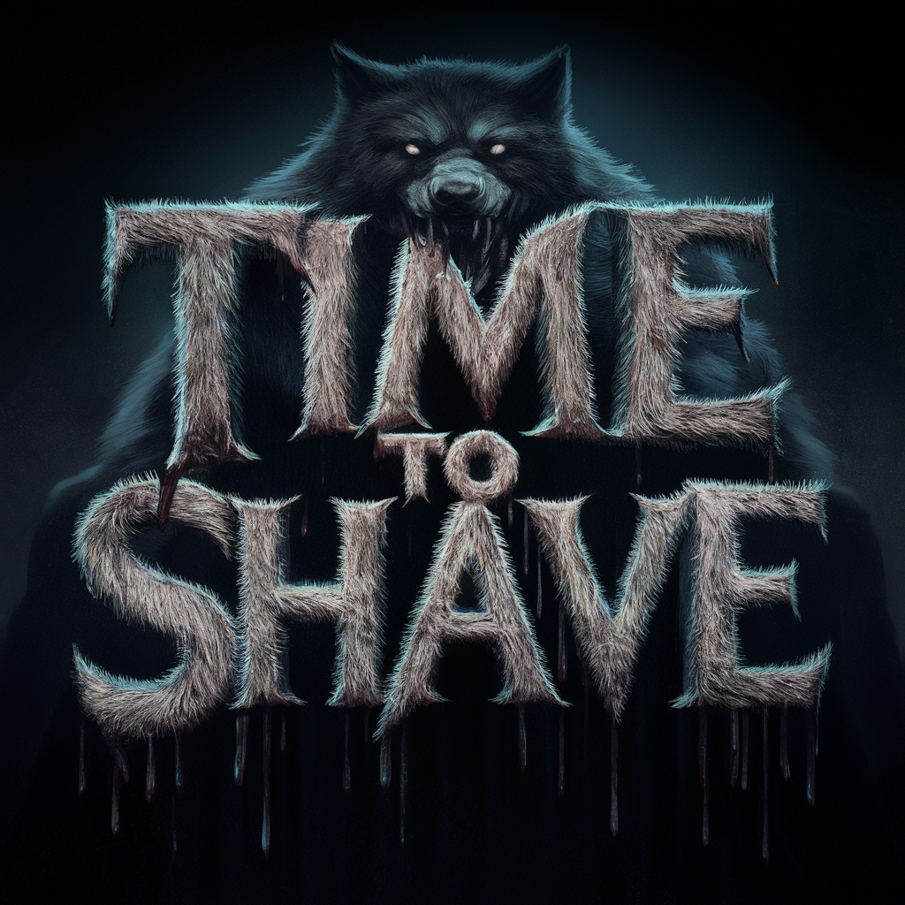
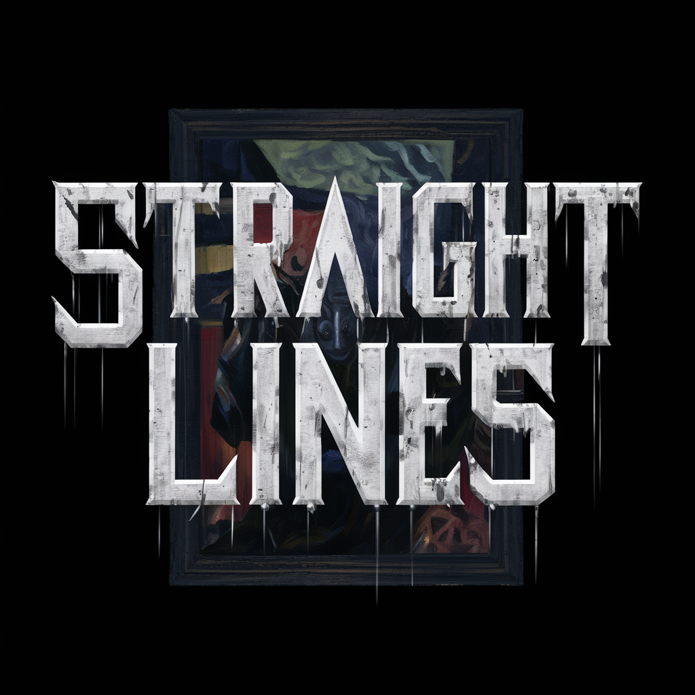
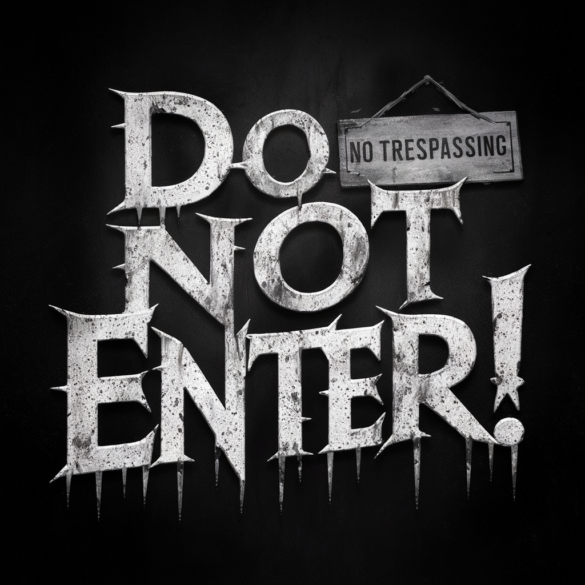
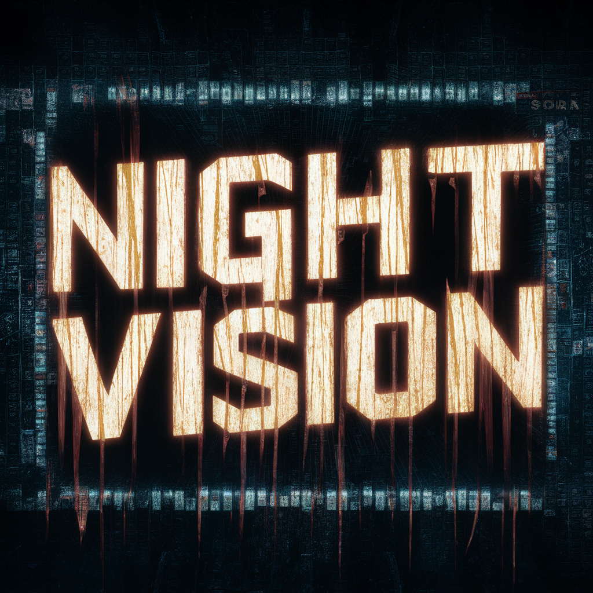
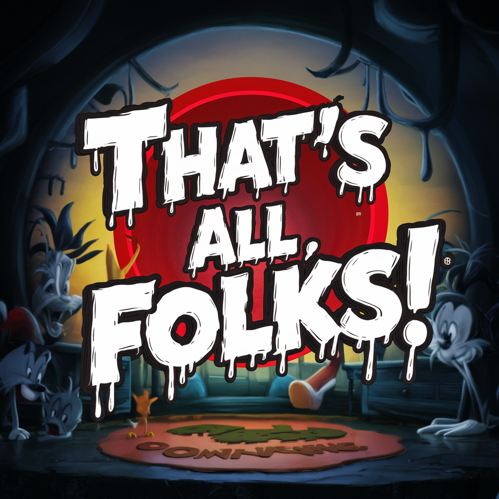
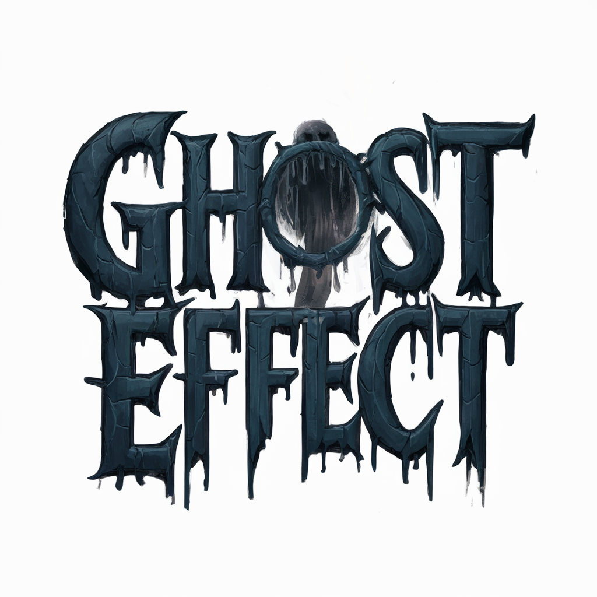
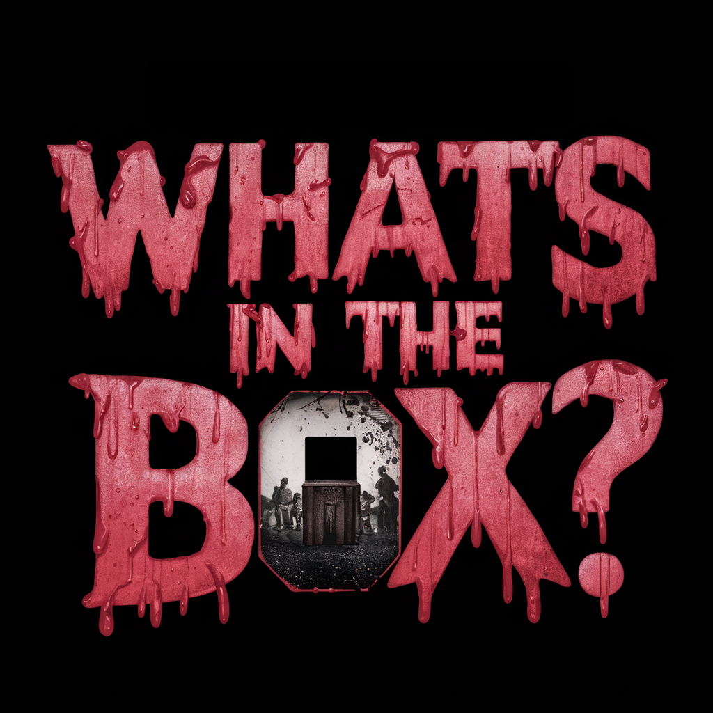

# House of Horrors
Package of Shaders to be used in Unity3D
Made for Bachelor's Degree discipline of Advanced 3D Programming Techniques (report in Portuguese included)

## Shaders Only

 

 

 

 

 
Surface Shader (Dissolve) * Triplanar Shader (Terrain) * Grabpass shader (Multiple)
Geometry Shader (Extrude) * Geometry Shader (Triangles)
Post Processing Shader (Glitch-Blur Effect) * Post Processing Shader (Sobel-Gaussian Effect) * Post Processing Shader (Ending Spotlight)
Vertex/Fragment Shader (Fresnel) * Vertex/Fragment Shader (Hologram) * Vertex/Fragment Shader (Section-Reveal)

## The Video

  

## Makers
- Ademar Valente
- Henrique Azevedo
- José Lourenço

 
